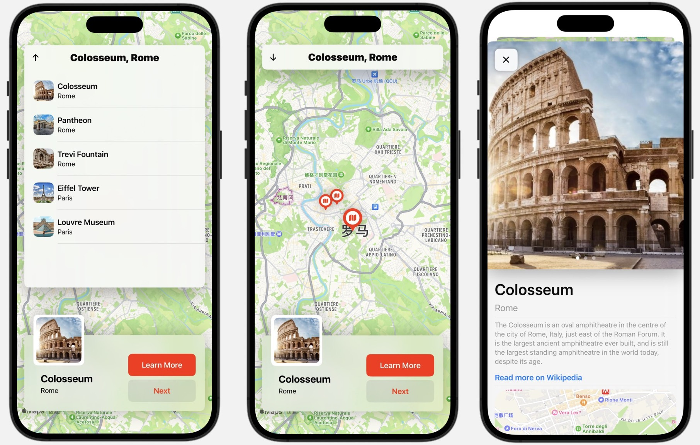
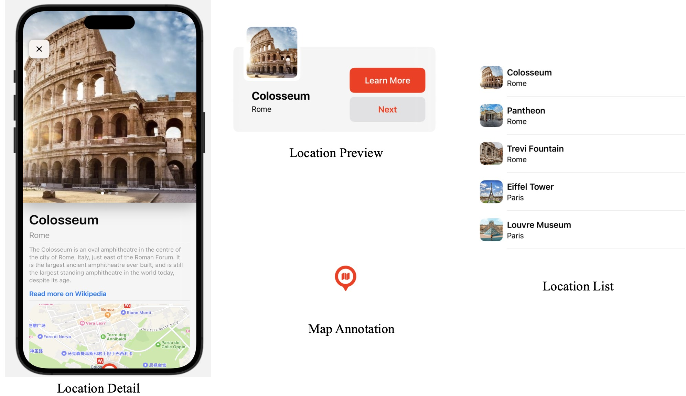
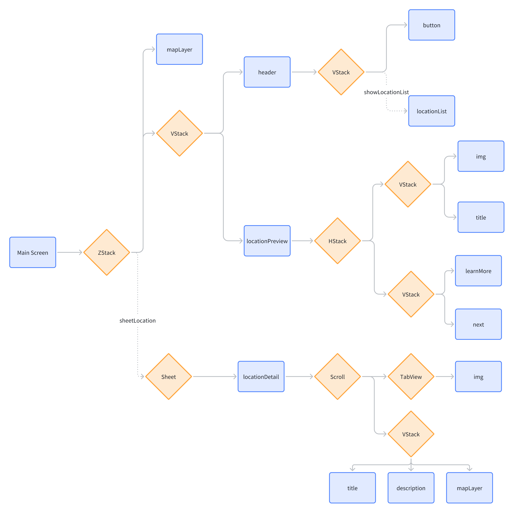

# My Map

> Thanks to the guidance from [Swiftful Thinking](https://www.youtube.com/@SwiftfulThinking)

## Introduction

- Simple map built with `Swift UI` to record meaningful locations
- `Model - ViewModel - View`
- Pure native `without` third-party packages
- No backend connection yet, data is written in advance
- Support IOS `17.0` and above

## Interface

## Component

## Structure

## Conclusion

It’s a simple project, but its structure and guidance are highly inspiring, especially for beginners like me (hhh)
